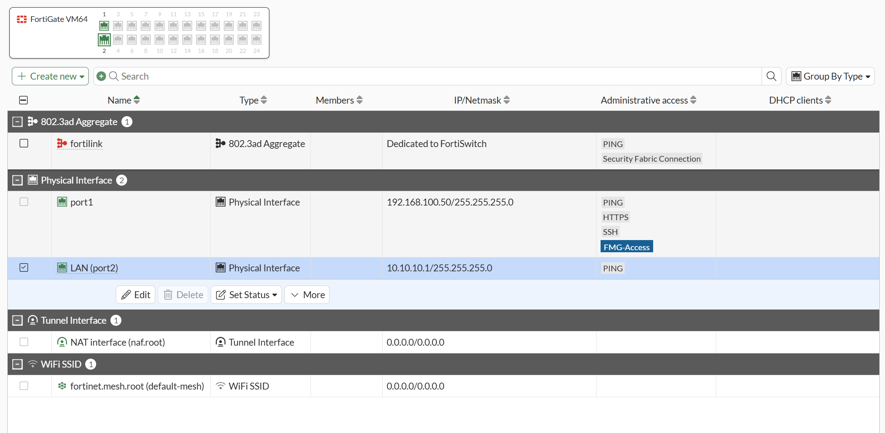
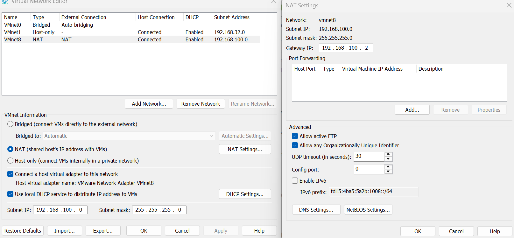
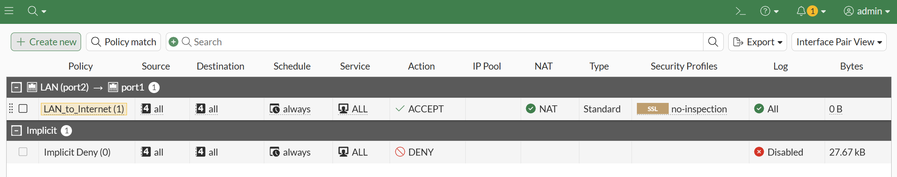
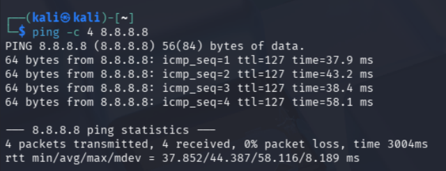
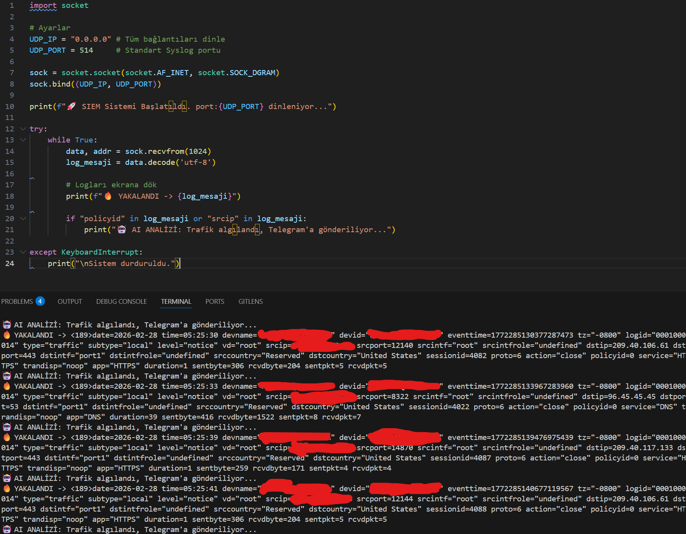
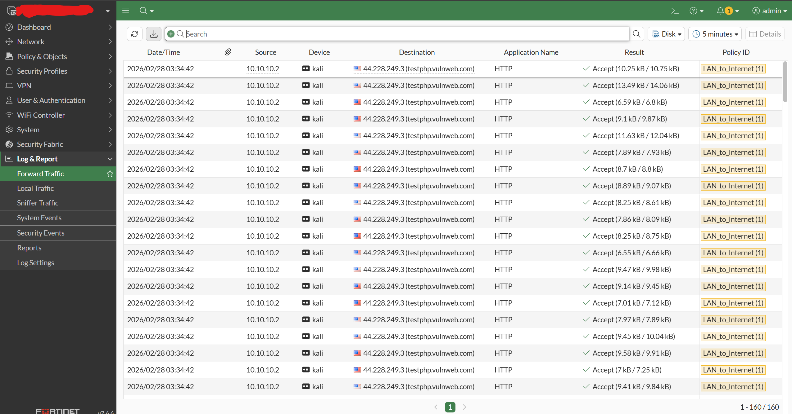
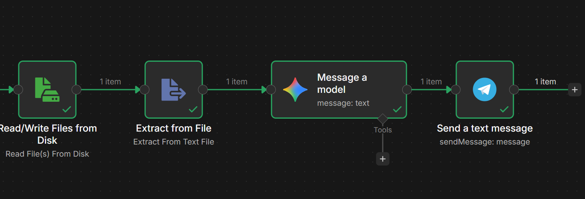
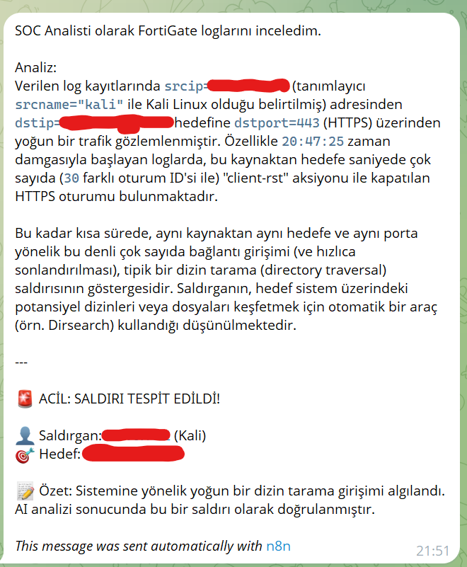

# 🛡️ GenAI-Assisted Enterprise DevSecOps Home Lab

**Author:** Süleyman | Computer Science Student (1st Year)
**Focus Area:** Cloud Infrastructure, Network Security, GenAI Automation

## 🎯 Project Objective
This project is built to demonstrate a practical, enterprise-grade approach to infrastructure security and incident response. By integrating an enterprise firewall (FortiGate) within an isolated VMware environment, simulating real-world attacks, and utilizing Generative AI (LLM) for automated log analysis via n8n, this lab acts as a fully functional **Mini AI-SOC (Security Operations Center)**.

## 🏗️ Architecture & Tech Stack

* **Hypervisor/Infrastructure:** VMware Workstation Pro (Custom VMnet Isolation)
* **Security Edge (Firewall):** Fortinet FortiGate VM64 (v7.6.6)
* **Offensive Security:** Kali Linux (Directory Traversal, Port Scanning)
* **Log Ingestion (Syslog):** Custom Python Script (UDP Port 514)
* **Automation & Orchestration:** n8n (Workflow Automation)
* **GenAI Integration:** LLM via API for intelligent log analysis
* **Alerting:** Telegram Bot API

---

## 🚀 Key Implementations & Proof of Concept

### 1. Enterprise Network Isolation (VMware & FortiGate)
Configured a zero-trust network boundary using VMware Virtual Network Editor:
* **WAN Zone (VMnet8 - NAT):** `192.168.100.0/24` (Simulating external internet).
* **LAN Zone (VMnet2 - Host-Only):** `10.10.10.0/24` (Isolated internal network).
* **FortiGate Gateway:** Successfully deployed as the bridge routing traffic between LAN (`10.10.10.1`) and WAN (`192.168.100.50`), confirmed via CLI static routing and successful DNS resolution.

>  ve 

### 2. Strict Firewall Policies & Traffic Forwarding
Created stateful firewall policies allowing monitored traffic from LAN (Kali) to the Internet, ensuring NAT is active and all sessions are logged for analysis. Verified connectivity by pinging `8.8.8.8` directly from the isolated Kali instance through the FortiGate firewall.

>  

### 3. Attack Simulation & Real-Time Log Capture (Python)
Initiated directory traversal and web vulnerability scans from Kali Linux (`10.10.10.2`) to an external target (`testphp.vulnweb.com`). 
Developed a custom **Python Syslog Server** listening on `UDP 514` to capture real-time traffic logs generated and forwarded by FortiGate. 

>  

### 4. GenAI-Powered Threat Analysis & Automation (n8n)
This is the core of the automated SOC pipeline. The raw logs captured by Python are processed through an **n8n automation workflow**:
1.  **Extract:** Raw FortiGate syslogs are extracted.
2.  **Analyze (GenAI):** The logs are sent to an LLM prompted to act as a Level 2 SOC Analyst.
3.  **Alert:** The AI detects the aggressive connection attempts (30+ sessions in seconds with "client-rst"), identifies it as an automated directory traversal attack (e.g., Dirsearch), and instantly pushes a translated, human-readable executive summary to a secure Telegram channel.

>  

---

## 💡 Conclusion & Future Scope
This lab proves that security is not just about blocking traffic, but about **observability and automated intelligence**. By combining infrastructure (FortiGate) with GenAI (LLM/n8n), the time taken to analyze raw firewall logs and detect an anomaly is reduced from minutes to mere seconds. 

*Next Steps: Integration with Azure Sentinel (Cloud SIEM) post-AZ-900 certification.*
